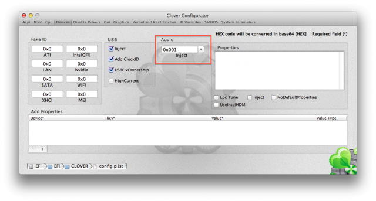

How make AppleHDA work
=======================

1. Check if you have deleted all the VoodooHDA Kexts (including `AppleHDADisabler.kext`! That's really important).
2. First of all, install this Kext with Kext Utility or any Kext Installer that you want.
3. To enable this AppleHDA, you should do `one` of following steps:
    * by using the `DSDT` i provided
	* by setting `Clover` in following way:
	
	
4. Restart and Check if it works.
