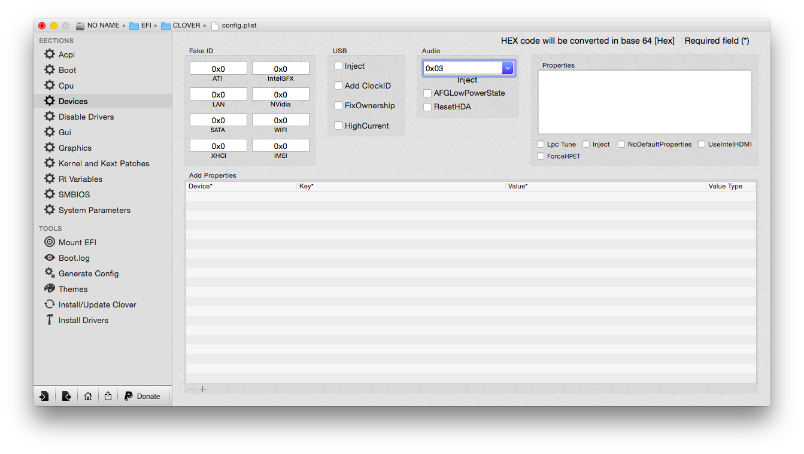
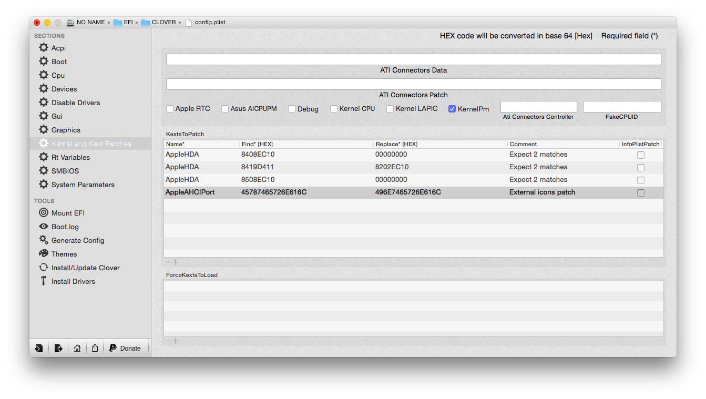

How make AppleHDA work
=======================

### Legacy Method (By replacing the Kext):

1. Check if you have deleted all the VoodooHDA Kexts (including `AppleHDADisabler.kext`! That's really important).
2. First of all, install this Kext with Kext Utility or any Kext Installer that you want. Don't forget to rebuild the cache and repair the permission.
3. To enable this AppleHDA, you should do `one` of following steps:
    * by using the `DSDT` i provided
	* by setting `Clover` in following way (Audio: 0x03):
	
	
4. Restart and Check if it works.

### On-The-Fly Update Method (By using Clover Kext-Patching Function):

>It's a improvement of making AppleHDA work, which we don't need any more to patch the AppleHDA.kext again and again after updating OS X (e.g. from 10.9.0 - 10.9.4 or even from 10.9 to 10.10). Clover takes over the the patching job and makes it very convenient.

The main idea is from [pokenguyen](http://www.insanelymac.com/forum/user/655057-pokenguyen/), if you want to learn how it generally works, [see here](http://www.tonymacx86.com/hp-probook-mavericks/118877-patch-applehda-kext-fly-clover-bootloader.html).

Now let's start.

1. Clover Setting as follow:

The values are: 
	* 3d 8408 ec10 -> 3d 0000 0000
	* 3d 8508 ec10 -> 3d 0000 0000
	* 3d 8419 d411 -> 3d 8202 ec10

2. Install the kext `DummyHDA.kext` with Kext Utility or any Kext Installer that you want. Don't forget to rebuild the cache and repair the permission.
3. To enable this AppleHDA, you should do `one` of following steps:
    * by using the `DSDT` i provided
	* by setting `Clover` in following way (Audio: 0x03):
	
4. Restart and Check if it works.